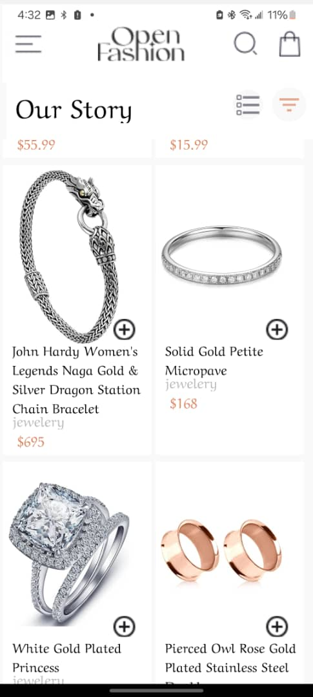

# Shopping Cart and Product Details App

## Overview

This app provides a simple yet effective shopping cart and product details interface, allowing users to add items to their cart and view product details, including care instructions and shipping information. The app is built using React Native, making it suitable for both iOS and Android platforms.

## Design Choices

### User Interface

- **Minimalist Design**: The app adopts a minimalist design approach, focusing on usability and readability. This is achieved through clean layouts, straightforward navigation, and the use of icons to convey information efficiently.
- **Custom Fonts**: The app uses the `ArefRuqaaInk_400Regular` font for a unique and elegant look, enhancing the overall user experience.

### Data Storage

- **AsyncStorage**: For persistent data storage, the app utilizes AsyncStorage to store cart items. This choice allows for a simple, yet effective way to persist user's cart data across app launches without needing a backend.
- **JSON Storage Format**: Cart items are stored in JSON format, enabling easy parsing and manipulation of the cart data. This approach simplifies the process of adding, removing, and retrieving items from the cart.

### Functionality

- **Add to Basket**: Users can add items to their basket, which updates the cart data stored in AsyncStorage. This feature demonstrates the app's ability to handle data persistence and state management.
- **Product Details**: The app provides detailed information about the products, including care instructions and shipping details, enhancing the shopping experience by providing all the necessary information in one place.

## Implementation

- **React Native**: The app is built using React Native, chosen for its cross-platform capabilities and extensive library support.
- **Expo**: The use of Expo simplifies the development process, providing a set of tools and services that facilitate the building, deploying, and quickly iterating on iOS and Android apps.
- **State Management**: The app uses React's useState and useEffect hooks for state management and to perform side effects, such as fetching cart data from AsyncStorage.

## Screenshots

## Conclusion

This app demonstrates a practical implementation of a shopping cart and product details interface using React Native and AsyncStorage. The design choices and implementation strategies were aimed at creating a user-friendly and efficient shopping experience. The use of AsyncStorage for data persistence and the minimalist design approach are key aspects of the app's functionality and aesthetic appeal.
